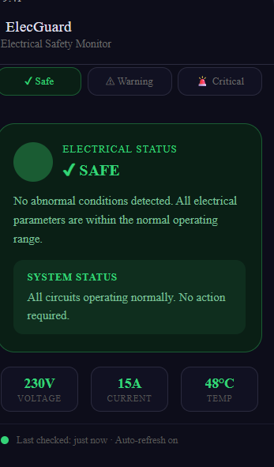
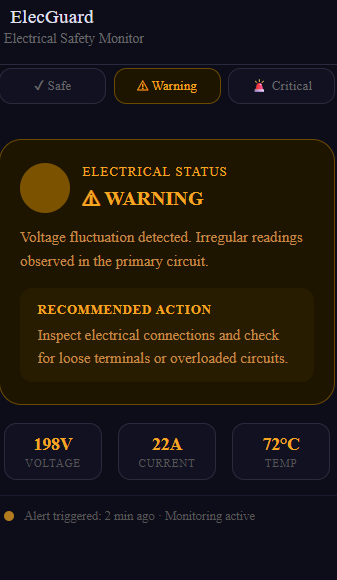
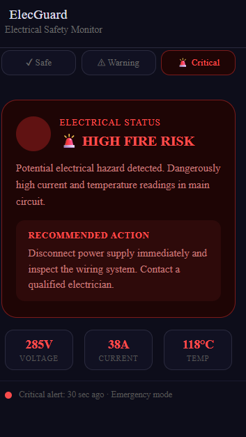

# Smart Electrical Fire Detection

## Overview
This project focuses on predicting electrical fires before they occur by continuously monitoring electrical parameters and identifying potential risks. The system aims to improve electrical safety through early warning and preventive measures.

## Problem Statement
Electrical fires are one of the major causes of property damage and safety hazards. Traditional systems often detect issues only after a fault has occurred. This project provides an early detection mechanism to reduce such risks.

## Objectives
- Monitor electrical conditions continuously
- Detect abnormal patterns and potential hazards
- Provide early warning alerts
- Improve safety and prevent electrical accidents

## Features
- Real-time monitoring
- Early risk detection
- Safety alerts
- Preventive maintenance support

## Applications
- Residential Buildings
- Industrial Facilities
- Commercial Complexes
- Smart Electrical Infrastructure

## Future Scope
- IoT Integration
- Mobile Application Support
- Cloud-Based Monitoring
- AI-Based Risk Prediction

- ## Application Screenshots

## Author
Royston Stewart
